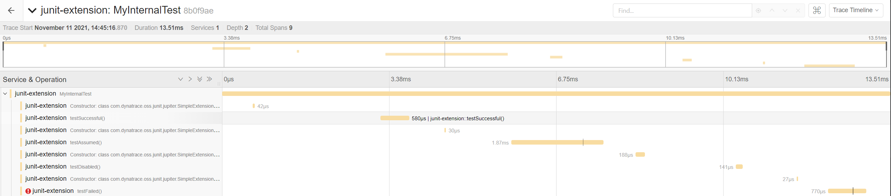

# junit-jupiter-open-telemetry-extension

Gradle plugin for gathering data of JUnit test executions via OpenTelemetry

## Setup

### Extension

Add the dependency to your build.gradle
```
dependencies {
    testImplementation 'com.dynatrace.oss.opentelemetry:junit.jupiter.exporter:${version}'
}
```

Make sure that the extension is loaded. This can be done in different ways.
 1. Put an annotation over your test class
```
@ExtendWith(TracingExtension.class)
public class Test {
```
2. Load the extensions via parameter
```
-Djunit.jupiter.extensions.autodetection.enabled=true
```
3. Set a system property
```
systemProperty("junit.jupiter.extensions.autodetection.enabled", true)
```

### Configure the Tracer

The recommended way is to use [autoconfigure](https://github.com/open-telemetry/opentelemetry-java/blob/main/sdk-extensions/autoconfigure/README.md) to do that.

```
implementation 'io.opentelemetry:opentelemetry-sdk-extension-autoconfigure:${version}'
```

## Tracing

This is what a trace of a test may look like:


The extension also adds the possibility to trace dynamic and parameterized tests.


